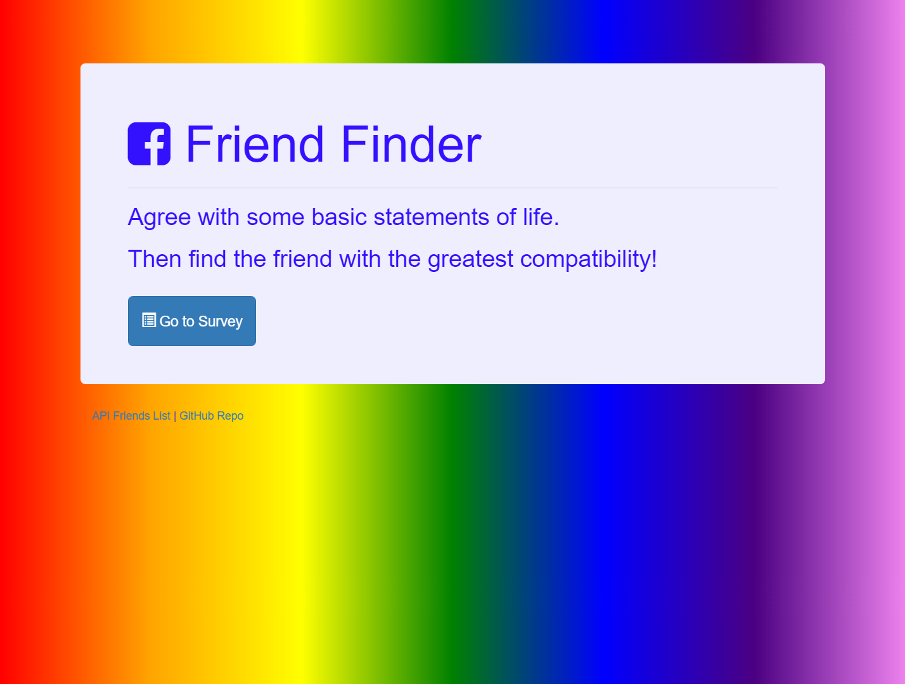

# Friend-Finder
This is my homework for week 13 of my Trilogy Boot Camp at the University of Pennsylvania.

##  Skill Sets Demonstrated
In this challenge I used Node and Express for the server, and then deploy it in a working state to Heroku. Learning about standardized file and folder structure was also required.

##To Fork and Play with this yourself
You will need to run *npm install* in the command line to have the node packages that will allow this to run for you.  After you have all the files, at the server.js level use `npm start` or `node server.js` to begin the fun.  Once it is running, from your browser you can interact with it at `localhost:8080/`.





<br>
<br>

### The asked for file structure:

  ```
  FriendFinder
    - .gitignore
    - app
      - data
        - friends.js
      - public
        - home.html
        - survey.html
      - routing
        - apiRoutes.js
        - htmlRoutes.js
    - node_modules
    - package.json
    - server.js
  ```

### Full Stack Skills Used to Date
*HTML
*Bootstrap
*In-line CSS
*JavaScript
*jQuery
*NodeJS
*ExpressJS
*git
*gitHub
*Google
*Asking for Help
*w3school
*stackoverflow
*scouring my classmates code, you guys and ladies are amazing!
